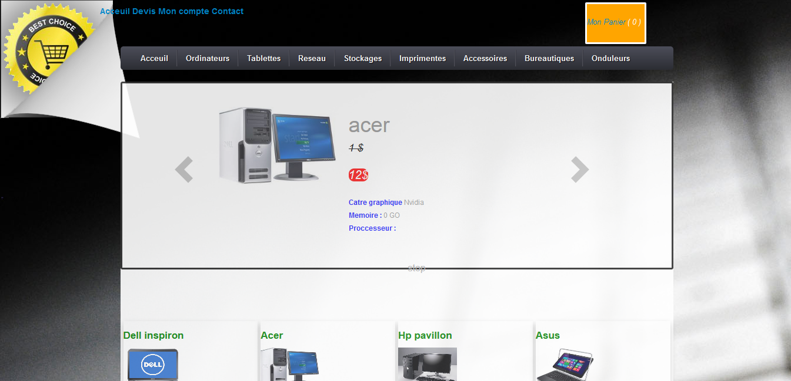

## Screenshot

 

## Description

The project consists of designing and putting into service an online sales website for computer equipment with the profile of the MTD group (a web development company).  
  

## Features

 - the website designed made it possible to serve the customer on the
   one hand by allowing them to select products, order them and purchase
   them via a secure payment service (Paypal).
 - this application also makes it possible to manage the various sales
   operations by allowing administrators to view orders and payments for
   each customer and to monitor product stock.

## Technologies

PHP, CakePHP, Java, J2EE JQuery, PostgresSQL

